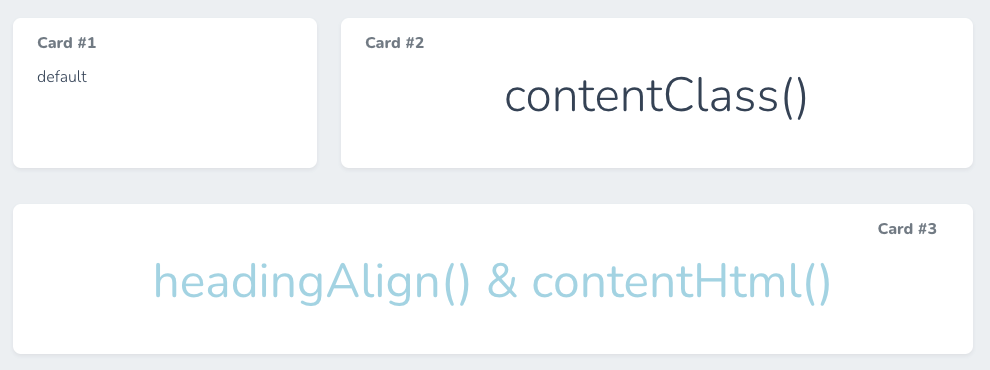

# Laravel Nova - Custom Text Card

A Laravel Nova card to customize card heading and content.



## Installation

You can install the package in to a Laravel app that uses [Nova](https://nova.laravel.com) via composer:

```bash
composer require gilbertchiao/nova-custom-text-card
```

Then, register your card in the `cards` method of the `NovaServiceProvider` or your `Resource` class.

```php
public function cards()
{
    return [
        (new CustomTextCard())
            ->heading('Card #1')
            ->content('default'),
        (new CustomTextCard())
            ->width('2/3')
            ->heading('Card #2')
            ->content('contentClass()')
            ->contentClass('text-5xl justify-center'),
        (new CustomTextCard())
            ->width('full')
            ->heading('Card #3')
            ->headingAlign('right')
            ->contentHtml('<p class="text-center text-5xl" style="color:lightblue;">headingAlign() & contentHtml()</p>')
    ];
}
```

## Options

### `width(string $width)`

The width of the card.

### `content(string $content)`

The content of the card.

### `contentClass(string $class)`

The custom class of the content.

The default class of the content block is "flex text-90 font-light items-center", the custom class would append to it.
If you want to replace the class, just prepend a "!" char to the $class, then the custom class would replace it.

Example:

* `->contentClass("justify-center") // "flex text-90 font-light items-center justify-center"`
* `->contentClass("!flex font-bold items-center justify-end") // "flex font-bold items-center justify-end"`

Note: This would not work for HTML-formatted content.

### `contentHtml(string $html)`

The HTML-formatted content of the card. If you set both content() and contentHtml(), only contentHtml() would work.

### `forceFullWidth()`

Force the card to be full width. [A fix for nova cards order](https://github.com/laravel/nova-issues/issues/1895).

### `heading(string $heading)`

The heading of the card.

### `headingAlign(string $alignment)`

The alignment of the heading (left, center, or right).

Note: This would not work for HTML-formatted heading.

### `headingHtml(string $html)`

The HTML-formatted heading of the card.

### `background(string $backgroundStyle)`

The CSS background property of the card.

### `border(string $borderStyle)`

The CSS border property of the card.

### `color(string $colorStyle)`

The CSS color property of the card.

### `height(string $height)`

The CSS height property or the card (default, auto, or NNNpx).

## Source

This package inspired by [Krato/NovaTextCard](https://github.com/Krato/NovaTextCard).

## License

The MIT License (MIT). Please see [License File](LICENSE) for more information.
